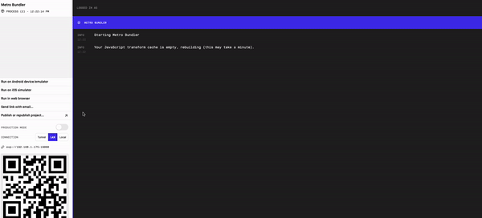

# React Native, Apollo Client and Expo App 

This project was bootstrapped with [Expo CLI](https://docs.expo.dev/get-started/create-a-new-app/).

This is an updated version of [this sample application](https://github.com/GraphQLGuide/guide-react-native). 

## Running locally
In the project directory, you can run:

`yarn start`

you can open iOS, Android, or web from here, or run them directly with the commands below:

`yarn android`

`yarn ios`

`yarn web`
#

